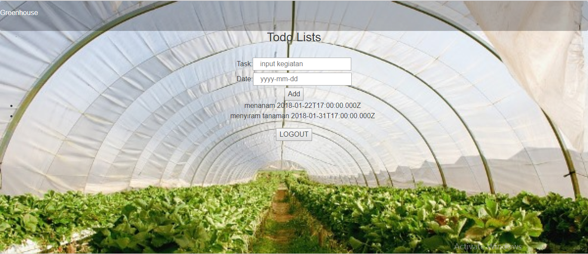

## README To-Do-List-NodeJS

* Aplikasi To-Do-List-NodeJS yang dibuat ini bertujuan untuk menambahkan dan menampilkan To-Do-List dari input yang tersedia di dalam aplikasi tersebut.
Sebelum dapat menjalankan aplikasi To-Do-List-NodeJS ini, user perlu melakukan `Sign Up` terlebih dahulu.

* Data `Sign Up` kemudian akan dimasukkan ke dalam database yang telah ditentukan. `Sign Up` memerlukan _username_ dan _password_ dari user atau pengguna.

* Proses memasukkan data _username_ dan _password_ dalam aplikasi ini menggunakan JQuery-Ajax. Data dari user akan dikirim ke database, lalu direspon. Contoh cuplikan _block-code_ JQuery-Ajax yang digunakan adalah sebagai berikut:
```javascript
	function insertData(userdata){
	$.ajax({
			type: 'POST',
			url: 'http://127.0.0.1:3000/adduser',
			data: userdata, 
			success: function(data){
				alert(data);
				console.log(userdata);
			},
			error: function(){
				alert('gagal');
			}
	});
	console.log(userdata);
	return check = true;
	}
```
* Setelah `Sign Up`, aplikasi akan merespon dengan melakukan _redirect_ ke halaman `Login`, seperti berikut:


* Di halaman `Login`, user kembali diminta untuk memasukkan _username_ dan _password_ yang telah dimasukkan sebelumnya ke database melalui proses `Sign Up`.

* Proses pengerjaan halaman `Log In` hampir serupa dengan proses pada halaman `Sign Up`. Aplikasi akan memanggil database _username_ dan _password_ menggunakan JQuery-Ajax, lalu meresponnya dengan melakukan _redirect_ ke halaman Profile. Contoh cuplikan _block-code_ JQuery-Ajax yang digunakan adalah sebagai berikut:
```javascript
function redirect(userdata){
      $.ajax({
          type: 'POST',
          url: 'http://127.0.0.1:3001/profile',
          data: userdata, 
          success: function(newData){
            console.log(userdata);
          },
          error: function(){
            alert('gagal kedua');
          }
      });
      window.location.replace("http://127.0.0.1:3001/profile");
    }
```
* Di dalam halaman Profile, user dapat menambahkan beberapa `To-Do-List` yang diinginkan.



* User dapat membuat `To-Do-List` dengan memasukkan _Task_ dan _Date_ di kolom yang tersedia.

* _Task_ dan _Date_ yang disubmit akan muncul pada halaman yang sama.
